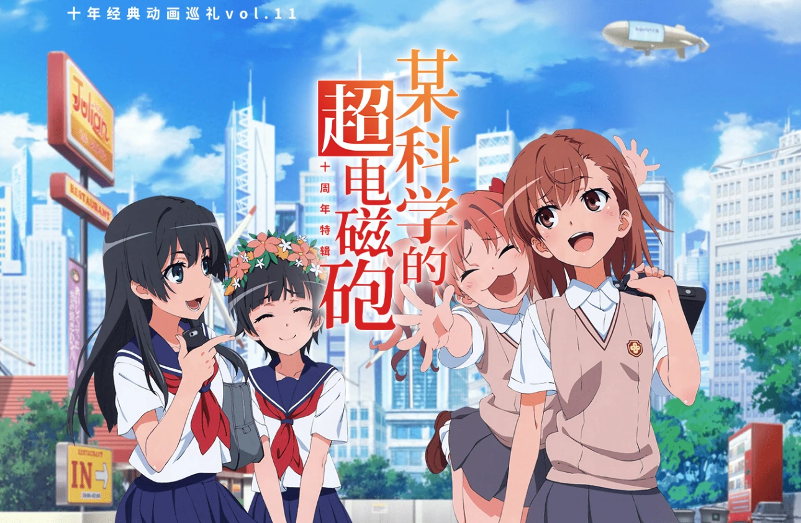
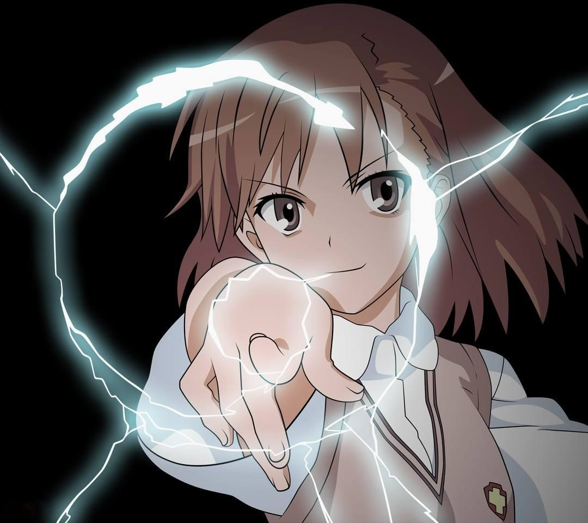
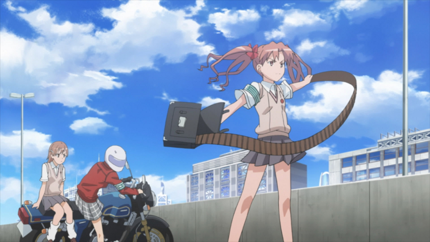
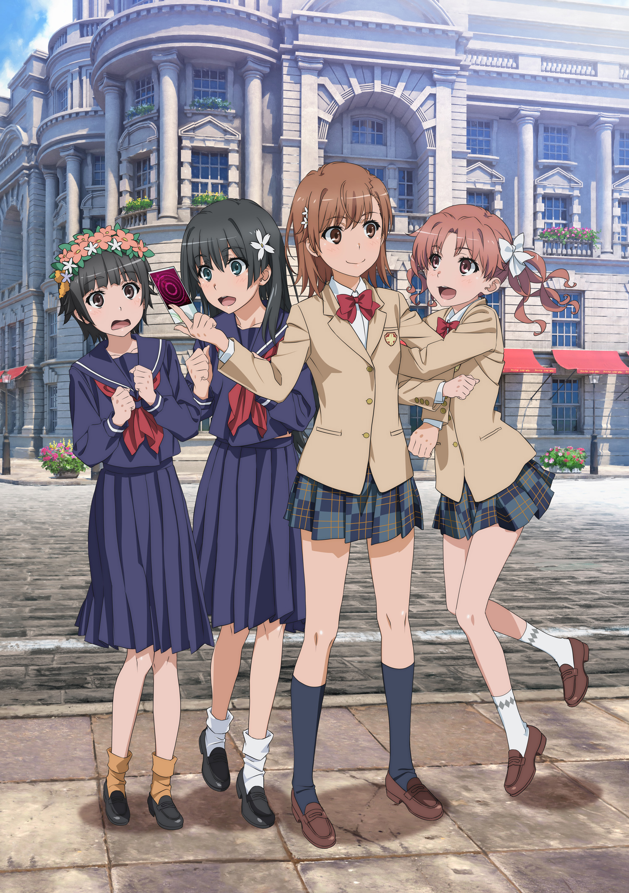
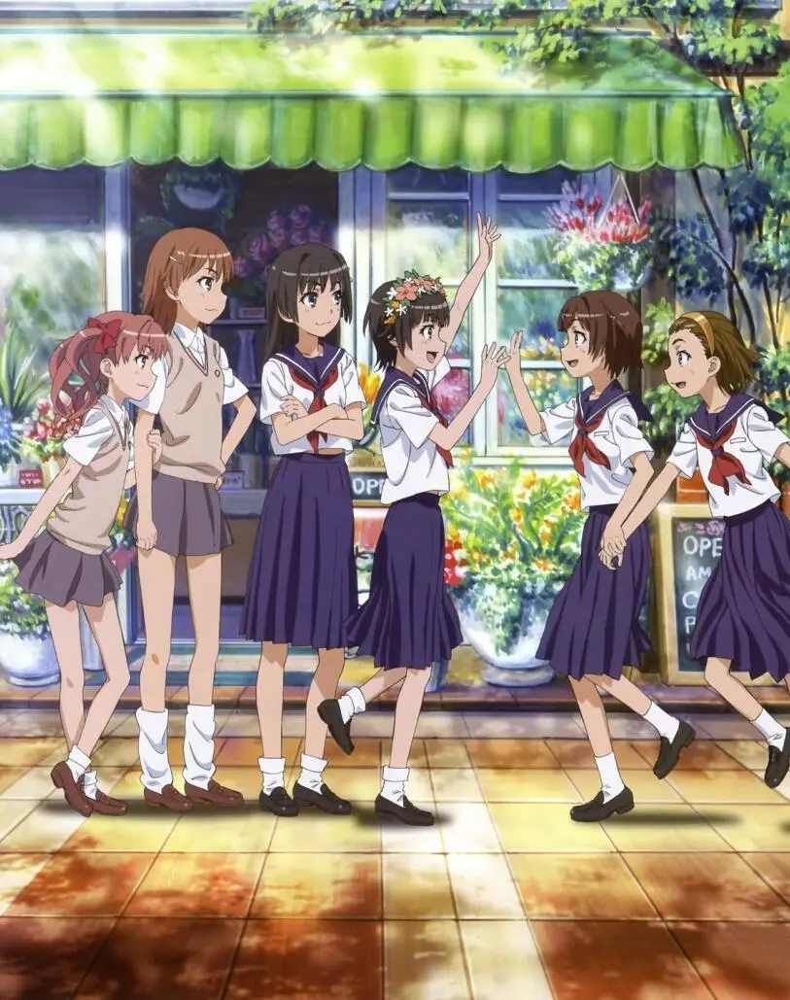

 

 
<!--more -->

这应该是在B站最有名气的一部番了,不光B站的投币传统来源于此，甚至BiliBili这个名字，也是来源于这部番中上条当麻对炮姐的第一面称呼。而我对它的第一印象也许就是在无数动漫歌曲合集中都有的那一首OP **only my railgun** 吧

<iframe style="display:block; margin: auto" frameborder="no" border="0" marginwidth="0" marginheight="0" width=330 height=86 src="//music.163.com/outchain/player?type=2&id=1379107099&auto=0&height=66"></iframe>



最后也是在回国前一周左右入了坑，当作日常番一样一天一两集的看，最后在机场把高潮一口气看完。我从未想过十年前的番居然已经能有和当下的动漫水平的画风和配乐了，第一感受觉得真无愧是镇站之宝。

## 剧情

首先便是对剧情的分析了，超炮第一部可以明显的分成前后两部分，前一部分除了主要的人物介绍和日常外，主要围绕Level-Upper (一首听了之后可以是无能力者获得能力的音乐) 展开，讲述炮姐四人组和木山老师的斗争，后面也有提及和Skill-out 武装无能力集团的争斗，但主要的矛盾核心其实是能力者与非能力者。学园都市有意将能力者于非能力者分为了两个阶层，能力越高自然享有的资源就越多也更加首仰慕，从这方面看来和学习成绩也无太大区别。但不同的在于大部分的能力是先天得来的而不能通过后天努力得到，这无异于在两个阶层间划下了深深的鸿沟，也正是阶层的固化导致了一系列事情的发生。值得注意的是所有的矛盾冲突基本上是无能力者落败，这其中是否也暗藏了某些隐喻？

后一部分叫“Poltergeist", 看评论说是编剧原创的，承接了上文木山老师的线，主要讲述的是炮姐四人组和木山老师联手去救出实验体孩子的故事。不像前半部分那么多的日常向，后半部分战斗的场面更多，也更为紧张刺激一些。打团的场面还是比单打独斗要更加精彩和感人。同时这部分也涉及到了学院都市的一部分真相和人体实验的伦理问题。也是从这里炮姐逐渐接触到了学园都市背后的黑暗面，也为后面的sister篇做了一些铺垫。


 

## 人物


 

其次谈谈其中的人物塑造

尽管正如其名，这部番是关于炮姐的外传，但主角并非集中于炮姐一人，而是黑子，初春和泪子及炮姐的四人组。可能是因为本番是外传并没有太赶的剧情，大部分人物性格的铺垫和北京都显得非常的舒缓自然。刚出场的五六集都是一个个独立的小故事，把学园都市宏大的背景设定缓缓拉开，各主角也一一登场。黑子对于炮姐近乎变态的喜欢和面对违法时的正义凛然，“掀裙狂魔”佐天泪子和她恰到好处的接话和缓和气氛(LV6 剧本预知), 还有害羞却出乎意料的坚信友情的初春饰利，都在我脑海里刻下了深深的印记。的确正如某些观众所批评的，超电磁炮的剧情更加偏向日常，“有些拖沓”，但这也正是它作为外传和魔禁本番的区别所在。通过生活的边边角角描绘出的日常不仅是对正传里面人物正面形象的补充，而且这种偏生活的真实感无疑也能够吸引很多和我一样喜欢日常番的观众。（看妹子打打闹闹嘻嘻哈哈有什么不好呢≡ω≡）

同时让我喜欢的还有一点就是超炮的叙述并不是完全围绕炮姐的，很多话中甚至没有炮姐的出场。编剧很大胆的用大段篇幅，甚至整话去描绘剧中的配角。也使这些配角在出场时不再是背景板（说的就是万年酱油anti-skill)，而能够更加的鲜活生动。（比如讲述anti-skill黄泉川还有小萌老师日常生活的那话我也是相当喜欢）

## 友情


 

**Friendship**, 我专门把这个提出来说，不仅是因为这是支持我一直把某科学的超电磁炮追下去的理由，同时这也是贯穿整个超电磁炮三部曲的主线。魔禁可能着重描写上条当麻拼尽全力去守护自己想要保护的一切的英雄气魄，而超跑则更加偏重描写炮姐作为Level5如何去融入她的伙伴，和她的伙伴一同欢喜，一同合作，一同战斗。在编剧的刻意导向下，御坂美琴也是拥有了更多的友情和陪伴，并在其中不断成长。从刚开始孤身面对木山和Level Upper变出的婴儿怪物，到最后和伙伴一同击败克里斯蒂娜，观众也都目睹了她本人作为主角的蜕变。最后四人组无论是追逐战时一同发出最强一击的默契，还是作为LV0走到最后一招破局的勇气，抑或是在主题曲回响中全力打出的超电磁炮，都足以令我触动。愿把后背托付的友情，这也许也正是当时海外孤独一人的我所期待的吧。

## 配乐

自从开始看本番我居然完完全全摒弃了之前跳OP和ED的做法，无论是OP1 ONLY MY RAILGYN 还是OP2 LEVEL5 -JUDGELIGHT  都是百听不厌。剧情内的配乐也都是恰到好处，炮姐对波的时候响起的OP真的可以称作是绝配了。并且无论是片头还是片尾曲填词也都是相当的棒，和剧情的联系也很充分，真的是让人不忍拖动进度条。

OP2

<iframe style="display:block; margin: auto" frameborder="no" border="0" marginwidth="0" marginheight="0" width=330 height=86 src="//music.163.com/outchain/player?type=2&id=4919477&auto=0&height=66"></iframe>

ED1

<iframe style="display:block; margin: auto" frameborder="no" border="0" marginwidth="0" marginheight="0" width=330 height=86 src="//music.163.com/outchain/player?type=2&id=1308782110&auto=0&height=66"></iframe>

ED2
<iframe style="display:block; margin: auto" frameborder="no" border="0" marginwidth="0" marginheight="0" width=330 height=86 src="//music.163.com/outchain/player?type=2&id=1308778122&auto=0&height=66"></iframe>

## 小小的总结

严格来讲的话 **某科学的超电磁炮** 其实非常的日常向，甚至因为太过于日常而让人忘了这是一部战斗番（第一次看的时候那个婴儿还有后面的机甲一瞬间居然感觉有些出戏），但整部番高质量的画风和编剧良好的节奏掌握和剧情导向也是部分补全了这些不足。整体来看，这部番可能并不会很受纯原著党的欢迎，但对于大部分路人来说确实是一部佳作。这种从偏日常的角度介绍人物的方法，既巧妙免去了了解学园都市复杂背景的繁琐，也没有不断出场需要科普的新角色，令人持续紧张的战斗或是长篇铺垫的剧情。同时也树立了炮姐比原著更加鲜明丰满的形象。炮姐能够在出道后便横扫无数萌王大赛第一，相必也与本番成功的塑造少不了联系。


 

> **君指先跃动の光は，私の一生不变の信仰に，唯私の超电磁炮永生き！**
